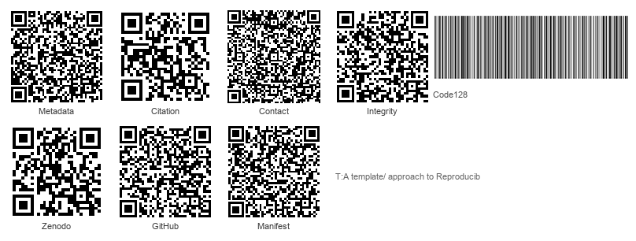
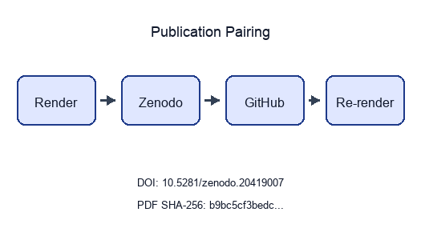

```{=latex}
\thispagestyle{empty}
\setlength{\parskip}{0pt}
\setlength{\itemsep}{0pt}
\begin{samepage}
\scriptsize
```

```{=latex}
\section*{BEGINNING OF TRANSMISSION}\label{beginning-of-transmission}
```

**State:** published

**Pairing:** complete (DOI, GitHub, SHA-256, Zenodo URL)

```{=latex}
\subsubsection*{Release metadata}
```

| Field | Value |
| --- | --- |
| Title | A template/ approach to Reproducible Generative Research |
| Version | 1.0.9 |
| Concept DOI | 10.5281/zenodo.20419007 |
| Version DOI | 10.5281/zenodo.20976048 |
| GitHub | [https://github.com/docxology/template_template/releases/tag/v1.0.9](https://github.com/docxology/template_template/releases/tag/v1.0.9) |
| Zenodo | [https://zenodo.org/records/20419007](https://zenodo.org/records/20419007) |
| SHA-256 | `535bd80943d0ae9f…` |
| SHA-512 | pending |

```{=latex}
\subsubsection*{How to verify}
```

- Scan **Integrity** QR and compare the embedded SHA-256 prefix to the table above.
- Scan **Zenodo** / **GitHub** QR codes and confirm they resolve to this release pairing.
- Full hashes and structured fields: `../data/transmission_manifest.json`.

{width=98%}

Structured manifest: `../data/transmission_manifest.json`

{width=35%}

**Stego:** off | overlays text | barcodes on | XMP on | manifest on → `./secure_run.sh`

```{=latex}
\end{samepage}
\newpage
```


<!-- BEGINNING OF TRANSMISSION -->


---


# Methods

The `template/` architecture is deliberately bifurcated into a globally shared `infrastructure/` layer and project-specific `projects/` silos. This section describes the four core design patterns, the YAML-declared pipeline (16 stages; default full 10) pipeline that operationalizes them, and the AI collaboration model that distinguishes this system from conventional research templates.

## The Two-Layer Architecture

The repository is organized into two strictly separated layers:

**Infrastructure Layer** (`infrastructure/`): 28 infrastructure subdirectories—25 of them independently-importable Python packages—comprising ~708 modules and providing reusable services. Each importable package has its own `__init__.py`, `AGENTS.md`, and `README.md`, and exports a well-defined public API (the remaining subdirectories, e.g. `config/`, hold shared configuration). The infrastructure layer knows nothing about any specific project---it provides generic capabilities (logging, rendering, validation, steganography) that any project may consume.

**Project Layer** (`projects/`): Self-contained research workspaces. Each project directory contains:

| Directory | Purpose |
|-----------|---------|
| `manuscript/` | Markdown chapters and `config.yaml` |
| `scripts/` | Thin orchestrator scripts (Stage 02) |
| `src/` | Project-specific Python modules |
| `tests/` | Project-specific test suite |
| `data/` | Input datasets and generated data |
| `output/` | Pipeline artifacts: PDF, figures, reports, logs |
| `docs/` | Project-specific architecture documentation |

The two layers communicate exclusively through Python imports and filesystem paths. No project modifies infrastructure code; no infrastructure module references a specific project by name (except via runtime project discovery).

## The Standalone Project Paradigm

Projects are designed to be completely self-contained. Adding a new project requires no changes to the infrastructure layer, no modifications to `pyproject.toml`, and no updates to the pipeline orchestrator. A project is automatically discovered if and only if it satisfies two conditions:

1. It exists as a subdirectory of `projects/`.
2. It contains the file `manuscript/config.yaml`.

This paradigm enables horizontal scaling: N researchers can maintain N independent projects within a single repository, sharing infrastructure without coupling. Each project declares its own testing tolerances, manuscript metadata, LLM review preferences, and rendering configuration in its `config.yaml`. The system currently hosts its public canonical exemplars under `projects/templates/` (`templates/template_active_inference`, `templates/template_advanced_literature_review`, `templates/template_autopoiesis`, `templates/template_autoresearch_project`, `templates/template_autoscientists`, `templates/template_code_project`, `templates/template_data_descriptor`, `templates/template_eda_notebook`, `templates/template_formal`, `templates/template_gold_refinement`, `templates/template_literature_meta_analysis`, `templates/template_madlib`, `templates/template_methods_paper`, `templates/template_newspaper`, `templates/template_pitch_deck`, `templates/template_pools_rules_tools`, `templates/template_prose_project`, `templates/template_redacted_report`, `templates/template_registered_report`, `templates/template_search_project`, `templates/template_sia`, `templates/template_storybook`, `templates/template_template`, `templates/template_textbook`), including this meta-manuscript at `projects/templates/template_template/`.

## The Thin Orchestrator Pattern

All scripts in `scripts/` (both infrastructure-level and project-level) follow the Thin Orchestrator pattern [@gamma1995design]:

- **No domain logic**: Scripts contain zero algorithmic implementation. They import functions from `src/` modules and wire them to infrastructure services.
- **Configuration-driven**: Behavior is parameterized by `config.yaml`, not by hardcoded values.
- **Stateless**: Scripts read inputs, call functions, write outputs. They maintain no persistent state between invocations.
- **Logged**: Every significant action is logged via `infrastructure.core.logging.utils.get_logger`.

This pattern ensures that all testable logic lives in `src/` where it is subject to the Zero-Mock testing policy, while scripts remain thin enough to be audited by visual inspection. The separation draws on the Mediator pattern from Gamma et al. [@gamma1995design], where scripts mediate between infrastructure services and project-specific code without implementing any logic of their own.

To make this concrete, the following contrasts the anti-pattern with the correct pattern:

```python
# ANTI-PATTERN: domain logic embedded in script
def calculate_average(data):          # ← never put computation here
    return sum(data) / len(data)

result = calculate_average([1, 2, 3])

# CORRECT PATTERN: script imports from src/ and only wires
from projects.my_project.src.statistics import calculate_average

result = calculate_average([1, 2, 3])  # ← scripts wire, never compute
```

The critical property is that `calculate_average` in the correct pattern lives in a testable `src/` module, is covered by the Zero-Mock test suite, and can be independently imported, tested, and reused—whereas the anti-pattern buries logic in a script that is invisible to coverage tools.


---


## DAG Pipeline Declared by `pipeline.yaml`

Single-project pipelines read `infrastructure/core/pipeline/pipeline.yaml`. `scripts/runner/execute_pipeline.py` expands the declarative DAG, applies tag filters (`--core-only` skips `llm` stages), checkpoints between nodes, then dispatches the declared `scripts/pipeline/stage_NN_*.py` scripts or builtin methods (`_run_clean_outputs`).

The **default YAML graph contains ten named core stages** (plus telemetry configuration metadata):

1. **Clean Output Directories** — wipes prior `projects/<name>/output/` + delivered `output/<name>/` paths so stale PDFs cannot satisfy validation.
2. **Environment Setup** (`scripts/pipeline/stage_00_setup.py`) — Python/uv probing, toolchain discovery, scaffolding directories, `PYTHONPATH` wiring.
3. **Infrastructure Tests** (`scripts/pipeline/stage_01_test.py --infra-only`) — `tests/` suite with the configured ≥60% source-coverage floor.
4. **Project Tests** (`scripts/pipeline/stage_01_test.py --project-only`) — isolated per-project suites with each project's declared floor (≥90% for this exemplar).
5. **Project Analysis** (`scripts/pipeline/stage_02_analysis.py`) — lexicographically ordered `projects/<name>/scripts/*.py`, each a thin orchestrator (`src/` does real work).
6. **PDF Rendering** (`scripts/pipeline/stage_03_render.py`) — Pandoc → XeLaTeX loop, bibliography assembly, injected variables from Stage 02 artefacts.
7. **Output Validation** (`scripts/pipeline/stage_04_validate.py`) — PDF structure, manifests, Markdown hygiene.
8. **LLM Scientific Review** (`scripts/pipeline/stage_06_llm_review.py --reviews-only`; `tags: llm`) — executive + quality critiques via local Ollama; `allow_skip: true`.
9. **LLM Translations** (`scripts/pipeline/stage_06_llm_review.py --translations-only`; tags `llm`, same dependency edges) — multilingual abstract expansion.
10. **Copy Outputs** (`scripts/pipeline/stage_05_copy.py`) — reproducible snapshots into canonical `output/<project>/`.

Two LLM nodes intentionally share one script module with orthogonal CLI switches; both depend only on validation so they can parallelize logically while remaining optional.

**Executive reporting** (`scripts/pipeline/stage_07_executive_report.py`) is **not** a YAML node inside the single-project executor. `--all-projects` / `execute_multi_project.py` invokes it once after iterating projects, consolidating cross-project KPIs dashboards.

Topological order therefore differs slightly from declaration order (e.g., copy executes after validation even though stage `stage_05_copy.py` precedes `stage_06_llm_review.py` lexically).

### Stage Highlights

**Infrastructure vs project tests.** Splitting pytest invocations isolates flaky infra regressions (`MAX_TEST_FAILURES` knobs) from zero-tolerance gates on domain code (`max_project_test_failures` default 0 declared in YAML front-matter/testing blocks).

**Stage 02 illustration.** The analysis stage is deliberately concrete rather than a hypothetical diagram factory: each canonical project ships real behaviour at this node. `template_autoresearch_project` runs readiness validation; `template_search_project` merges remote literature JSON, generates scripted figures (`y_generate_search_figures.py`), and writes manifests; `template_code_project` emits optimization plots; and `template_prose_project` triggers structural validation scaffolding. The pipeline shape is identical across all four—only the Stage 02 payload differs—which is exactly what lets one orchestrator serve heterogeneous research domains.

### Interactive Orchestration

#### `run.sh`

Thin wrapper invoking `python -m infrastructure.orchestration`. Offers:

- per-project staged execution,
- chained digits (`234` shorthand),
- multi-project grid (`a`–`d` presets),
- graceful quit / resume parity with `scripts/README.md`.

Selecting **`d` alone** after a passing multi-project run exits immediately once summaries print—avoiding repetitive menu redraw.

#### `secure_run.sh`

Executes Python `secure` path: standard pipeline artefact reproduction **then** invokes `run_secure_pipeline` for steganographic PDF hardening (`infrastructure.steganography`). Original PDFs stay immutable; hardened companions carry QR overlays plus hash manifests sidecars.


---


## Documentation Duality and AI Collaboration {#documentation-duality-and-ai-collaboration}

Every directory at every level of the repository hierarchy contains two documentation files:

- **`README.md`**: Human-readable overview, quick-start instructions, and directory structure.
- **`AGENTS.md`**: Machine-readable technical specification optimized for AI coding assistants. Contains API tables, dependency graphs, implementation patterns, and architectural constraints.

This Documentation Duality standard serves two purposes. First, it ensures that both human researchers and AI agents can navigate the codebase efficiently—`AGENTS.md` files provide the structured context that language models need to make informed code modifications without hallucinating API signatures or violating architectural invariants. Second, it creates a self-documenting feedback loop: as AI agents modify the codebase, they update the corresponding `AGENTS.md` files, keeping documentation synchronized with implementation. Lau and Guo's survey of 90 AI coding assistant systems [@lau2025aicoding] identifies contextual code understanding as a primary bottleneck; the Documentation Duality standard addresses this by providing pre-structured context at every directory level.

The template additionally includes `CLAUDE.md` at the repository root, providing system-level instructions for AI coding assistants—architectural principles, testing requirements, and naming conventions that apply globally. This creates a three-tier documentation architecture: per-directory `AGENTS.md` for local context, root `README.md` and `CLAUDE.md` for global constraints, and `README.md` for human navigation.

## Agentic Skill Architecture {#agentic-skill-architecture}

The [Documentation Duality](#documentation-duality-and-ai-collaboration) standard addresses human and AI navigation at the directory level. A complementary layer operates at the *module* level: every infrastructure subpackage carries two additional machine-readable files that transform it from a passive code library into an active, protocol-aligned skill endpoint.

### The Three-Tier Skill Protocol

`template/` implements a progression of agent-facing documentation, escalating in specificity from global constraints to module-level API contracts:

| Tier | File | Scope | Purpose |
|------|------|-------|---------|
| 1 — System | `README.md` | Repository root | Global architectural principles, Zero-Mock policy, naming conventions |
| 2 — Structure | `AGENTS.md` | Every directory | Local file inventories, API surfaces, integration patterns, architectural constraints |
| 3 — Skill | `SKILL.md` | Every infrastructure module | Machine-parseable skill descriptor: module name, description, key imports, usage pattern |

Tier 1 and Tier 2 have direct analogues in the prompt-engineering literature: system prompts and retrieval-augmented context [@lau2025aicoding]. Tier 3 is novel. The `SKILL.md` files follow a YAML frontmatter + Markdown instruction format precisely aligned with the tool-descriptor schemas of the Model Context Protocol [@anthropic2024mcp]. The following is the actual frontmatter from `infrastructure/rendering/SKILL.md`:

```yaml
---
name: infrastructure-rendering
description: Skill for the rendering infrastructure module providing multi-format output generation including PDF manuscripts, HTML web pages, and Beamer/Reveal.js slides. Use when rendering research outputs, converting markdown to PDF, generating slides, or configuring LaTeX rendering.
---
```

An MCP client reading this block immediately knows the module name, its natural-language activation condition ("use for"), and which Python symbols to import. No source-code inspection is required. This is the practical implementation of Toolformer-style self-documented tools [@schick2023toolformer]—rather than a language model learning tool APIs from training data, the APIs are encoded directly in version-controlled, co-located skill files that evolve with the codebase.

### Module Skill Coverage

Each infrastructure subdirectory surfaced by `discover_infrastructure_modules()` carries paired `README.md` + `AGENTS.md`; agent-facing `SKILL.md` manifests exist wherever teams enable Cursor / PAI manifests (regenerated via `python -m infrastructure.skills`). Root-level `PAI.md` summarizes cross-package obligations.

Promotion policy: new Layer‑1 directories must ship human + machine-readable docs (`README.md`, `AGENTS.md`) immediately; Tier‑3 SKILL assets follow once APIs stabilize.

### MCP Server Mapping

The mapping from `SKILL.md` descriptors to MCP server endpoints is intentional but not yet automated; it represents the principal next integration step. In the MCP architecture [@anthropic2024mcp], a server exposes three primitive types: **Tools** (executable functions), **Resources** (data the model can read), and **Prompts** (structured query templates). Each `infrastructure` module maps naturally onto this taxonomy:

- `infrastructure.llm` → MCP **Tool** (`query`, `apply_template`) + MCP **Prompt** (research prompt templates)
- `infrastructure.rendering` → MCP **Tool** (`render_pdf`, `render_html`) + MCP **Resource** (rendered PDFs as URI-addressable resources)
- `infrastructure.validation` → MCP **Tool** (`validate_pdf_rendering`, `validate_markdown`)
- `infrastructure.publishing` → MCP **Tool** (`publish_to_zenodo`, `generate_citation_bibtex`) + MCP **Resource** (DOI registry)
- `infrastructure.steganography` → MCP **Tool** (`SteganographyProcessor.process`) + MCP **Resource** (hash manifests)
- `infrastructure.search` · `infrastructure.reference` → MCP **Tool** wrappers over literature retrieval + BibTeX handling + MCP **Resource** exports for corpus JSON / `.bib`

An agent orchestrating a full research pipeline could, in principle, compose these MCP tools to reproduce the declarative DAG programmatically—discovering capabilities via `SKILL.md` frontmatter, executing them via MCP protocol calls, and consuming their outputs as Resources. The `SKILL.md` files parallel Voyager's skill library [@wang2023voyager]—Voyager's agent accumulates a growing library of executable Minecraft skills represented as JavaScript functions; `template/`'s agent accumulates a curated library of research pipeline skills represented as YAML-frontmattered `SKILL.md` files. In both cases, the skill representation is machine-readable, version-controlled, and self-describing. Wang et al.'s LLM agent survey [@wang2024llmagents] identifies tool use, planning, and memory as the three fundamental capabilities of autonomous agents; Yao et al.'s ReAct framework [@yao2023react] demonstrates that interleaving reasoning traces with tool actions dramatically improves agent reliability in interactive settings. The `template/` skill architecture maps cleanly onto these three capabilities: the `SKILL.md` descriptors supply the tool-use layer, the declarative DAG of `16` `pipeline.yaml` stages (a default full run executes `10`) supplies the planning scaffold, and the per-criterion checkpoint system supplies the memory layer.


---


## FAIR Alignment and Research Infrastructure as Code

The template's design aligns with both the original FAIR principles [@wilkinson2016fair] and the FAIR for Research Software (FAIR4RS) principles [@barker2022fair4rs] at the repository level. FAIR4RS recognizes that software has requirements distinct from data—executability, composability, and dependency management—and the template addresses each.

### Principle-by-Principle Alignment

**Findability.** Outputs are *Findable* through standardized directory structures, manifest files, and machine-readable metadata embedded in PDFs. Every project's `config.yaml` provides structured metadata (title, authors, DOIs, keywords) in a format parseable by both Pandoc and external indexing services. The `metrics.json` output provides a machine-readable inventory of all generated artifacts, their locations, and their provenance hashes.

**Accessibility.** Outputs are *Accessible* via open-source distribution on GitHub, with metadata embedded in the artifact itself rather than in a separate registry. The steganographic layer embeds provenance information directly in the PDF—including SHA-256 content hashes, build timestamps, and QR-encoded metadata—ensuring accessibility even when the PDF circulates outside the repository.

**Interoperability.** *Interoperability* is achieved through standard formats (PDF, JSON, BibTeX, YAML) and well-defined module APIs that enable cross-project composition. The Pandoc rendering pipeline accepts any Markdown-with-LaTeX input conforming to the template's section numbering conventions, allowing seamless migration of manuscripts from other Pandoc-based workflows.

**Reusability.** *Reusability* is ensured by the Standalone Project Paradigm—any project can be extracted and reused independently—and by the Documentation Duality standard, which satisfies FAIRsoft's inspectability and documentation quality indicators [@garijo2024fairsoft]. The pipeline's automated testing and coverage enforcement directly operationalize the FAIR4RS executability requirement: software that cannot pass its own test suite cannot produce publishable output.

### Infrastructure as Code for Research

At a higher level of abstraction, `template/` applies the DevOps principle of *Infrastructure as Code* (IaC) to the research lifecycle. In production software engineering, IaC means that server configuration is version-controlled, automatically provisioned, and independently reproducible [@wilson2017good]. `template/` extends this principle to the research manuscript: the document is not authored in a word processor and emailed to collaborators, but *built* from version-controlled Markdown sources, *tested* against formal coverage thresholds, and *deployed* to a provenance-embedded PDF.

Every component of the research pipeline—the test suite, the analysis scripts, the rendering configuration, and the steganographic watermark—is specified in code, committed to git, and reproducible from a clean checkout. This deterministic build property means that any researcher can clone the repository, run `./run.sh --pipeline`, and produce a byte-for-byte identical manuscript (modulo timestamps in the steganographic metadata).

Software Heritage [@cosmo2020softwareheritage] provides persistent SWHIDs (Software Hash Identifiers) for source code snapshots, enabling stable citation of any specific version of `template/` as a discrete software artifact—closing the loop from research infrastructure to citable scientific contribution. Combined with Zenodo DOI registration (supported by `infrastructure.publishing`), this creates a dual-identifier citation chain: SWHID for source provenance, DOI for publication metadata [@katz2021software].


---


## Quality Assurance

### Zero-Mock Testing Policy

The repository policy prohibits mock frameworks such as `unittest.mock`, `MagicMock`, and `patch` decorators [@martin2008clean; @meszaros2007xunit]. A static gate rejects those imports, and a separate inventory surfaces semantic dependency-replacement patterns for review. Tests that require external services (Ollama or public networks) use explicit `pytest.mark` markers for conditional execution; deterministic network tests use real local HTTP servers. The philosophical motivation—analogizing excessive interaction mocking to Simmons et al.'s *researcher degrees of freedom* [@simmons2011falsepositive] and the preregistration remedy [@nosek2018preregistration]—is developed fully in the [Zero-Mock Tradeoff](05a_zeromock_tradeoff.md#the-zero-mock-tradeoff) discussion.

The following example, drawn from this meta-project's own suite, illustrates zero-mock compliance:

```python
def test_core_module_present(self):
    # Real filesystem, real YAML parsing — no MagicMock anywhere
    modules = discover_infrastructure_modules(REPO_ROOT)
    names = [m.name for m in modules]
    assert "core" in names, f"'core' not found in {names}"
```

This test (`tests/test_meta.py::TestDiscoverInfrastructureModules::test_core_module_present`) exercises the real `discover_infrastructure_modules` function against the real repository root. There are no mock objects substituting for the directory walk, no patched YAML parsers, and no synthetic return values—the test passes only if the infrastructure modules genuinely exist and are discoverable at their expected paths.

### Coverage Thresholds

The pipeline enforces two coverage tiers:

| Tier | Scope | Minimum | Current | Rationale |
|------|-------|:-------:|:-------:|-----------|
| Project | `projects/*/src/` | 90% | Reported by the current test artifact | Domain code must be thoroughly validated |
| Infrastructure | `infrastructure/` | 60% | Reported by the current test artifact | Broader shared surface |

These thresholds are enforced at Stage 01 of the pipeline. A project test run below its declared 90% floor fails before downstream publication stages. This manuscript deliberately does not quote an achieved coverage percentage unless a fresh coverage artifact supplies it.

### Test Suite Composition

The repository maintains three test suites:

- **Infrastructure tests** (`tests/`): ~9,557 tests validating the 28 infrastructure subdirectories, covering logging, rendering, validation, steganography, reporting, and LLM integration.
- **Project tests** (`projects/*/tests/`): Per-project suites whose sizes scale with each exemplar's surface area — for example 300 tests in `template_autoresearch_project` and 242 in `template_code_project`, with several exemplars larger still. (A true min/max span would require dedicated `project_test_count_min`/`project_test_count_max` tokens in `build_manuscript_metrics_dict`; see the meta-template's generator backlog.)
- **Integration tests**: Embedded within infrastructure tests, these exercise full pipeline stages against real manuscript inputs, validating end-to-end behavior from Markdown source to rendered PDF.

### Visualization Standards

All generated figures must meet accessibility requirements:

- Shared 16pt font constant for primary text elements, with compact annotations derived from that constant.
- Colorblind-safe palettes (IBM Design / Wong palette) with high-contrast fallbacks.
- 200 DPI PNG rendering, sourced from the same constant used by every figure writer.
- Descriptive axis labels and figure titles.
- No reliance on color alone to convey information—redundant encoding via shape, pattern, or annotation is used where applicable.

The `test_architecture_viz.py` suite verifies that each real figure generator writes a non-empty PNG and that the comparative matrix has its declared shape and value domain. The font and render-resolution values above are injected from `viz_palette.py`, preventing prose and implementation from drifting even though visual accessibility still requires human inspection of rendered figures.


---


# Discussion

## The Zero-Mock Tradeoff

The [Zero-Mock testing policy](03e_quality.md#zero-mock-testing-policy) is `template/`'s most distinctive design decision. By prohibiting all mock objects, we gain confidence that tests exercise real code paths---a pytest run against the template genuinely invokes `pandoc`, writes to disk, and parses real YAML. The cost is test duration: the full infrastructure test suite (~9,557 tests) runs for minutes rather than the sub-second execution typical of heavily-mocked suites. This manuscript deliberately reports no wall-clock figure, consistent with the Results section's discipline of declining timing claims without a versioned benchmark artifact.

We argue this tradeoff is strongly favorable for research software. Unlike web applications where millisecond latency and thousands of daily deploys demand fast feedback loops, research pipelines run infrequently (once per manuscript revision) and correctness vastly outweighs speed. A mocked test that passes while the real renderer fails is worse than a slow test that catches the failure. The analogy to statistical methodology is precise: just as Simmons et al.'s *researcher degrees of freedom* [@simmons2011falsepositive] inflate false-positive rates through undisclosed analytical flexibility, mock objects create *testing degrees of freedom* that make integration failures invisible. The Zero-Mock policy closes this loophole by the same mechanism that pre-registration [@nosek2018preregistration] closes the p-hacking loophole: removing flexibility before the fact. As Peng [@peng2011reproducible] argues, computational reproducibility requires independent verification---and mock-only tests verify assumptions rather than results. Garijo et al.'s FAIRsoft evaluator [@garijo2024fairsoft] identifies *executability* as a primary quality indicator; the Zero-Mock policy operationalizes executability at the unit level.

### When Mocks Are Not the Problem

It is important to distinguish the Zero-Mock policy from a naive rejection of all test isolation techniques. Fowler's classification [@martin2008clean] recognizes that stubs and fakes serve legitimate purposes—a test database populated with known data is not a mock, it is a fixture. The policy specifically prohibits *mock objects* as defined by Meszaros: assertions on indirect outputs (method calls, argument patterns) rather than direct outputs (return values, side effects). The distinction matters because mock-based assertions encode implementation assumptions ("method X must be called with argument Y") that become invisible coupling between tests and production code, creating the illusion of coverage without testing real behavior.

### Practical Implementation

The template enforces zero-mock compliance at three levels:

1. **Code review**: `AGENTS.md` at every directory level explicitly states the prohibition, ensuring both human and AI contributors are aware before writing tests.
2. **Static analysis**: `scripts/audit/verify_no_mocks.py` implements the enforced lexical gate (prohibited mock-framework imports and calls) and an `--inventory` mode that separately classifies environment isolation from dependency-replacement debt; pre-push runs it automatically.
3. **Cultural norm**: `template_code_project` documents filesystem + YAML + plotting paths while `template_autoresearch_project` exercises readiness planning; `template_search_project` reinforces HTTP-realistic literature queries—both serve as onboarding references alongside infra suites.

However, the policy requires careful management of external dependencies. Tests requiring Ollama (the local LLM backend) use `@pytest.mark.requires_ollama` and are skipped in environments where the service is unavailable. Tests requiring network access use `@pytest.mark.network`. This marker system preserves the Zero-Mock principle while acknowledging that not all environments provide all services, especially computationally intensive ones. The key distinction is between *replacing* an external dependency (which mock objects do, hiding failures) and *skipping* a test when a dependency is absent (which markers do, preserving transparency).


---


## Comparison to Existing Tools

The [gap analysis](02_introduction.md#the-gap) established that no single tool integrates all six cross-cutting concerns. Here we synthesize the [fourteen-dimension comparison](08f_appendix_matrix.md#appendix-matrix) into three structural insights. First, the landscape bifurcates: workflow managers (Snakemake [@koster2012snakemake], Nextflow [@ditommaso2017nextflow], CWL [@amstutz2016cwl]) provide distributed execution but no manuscript support; publication tools (Quarto [@allaire2024quarto], Jupyter Book, R Markdown [@xie2018dynamic], Overleaf [@overleaf2025], Prism [@openai2026prism]) author documents but embed no integrity guarantees; and DVC [@iterative2024dvc] versions artifacts without orchestrating pipelines. `template/` occupies the intersection, sacrificing distributed execution for unified enforcement of testing, provenance, and documentation. This positioning is complementary—a mature deployment might use Nextflow upstream and `template/` for rendering, testing enforcement, and provenance downstream. Typst [@madje2023typst], with its faster compilation cycle, is not one of the nine compared peers but could serve as an alternative rendering backend if a Pandoc writer were contributed.

Second, the eight enforcement capabilities `template/` co-locates—testing enforcement, coverage thresholds, steganographic watermarking, multi-project management, AI-agent documentation, the agentic skill protocol, an interactive TUI, and Zero-Mock policy—are individually straightforward (and several, such as multi-project management and AI-agent documentation, are matched in part by individual peers). Their value here lies in a shared pipeline contract: required test and documentation gates run together, while selected provenance stages carry their own validation. The FAIR4RS principles [@barker2022fair4rs; @lamprecht2020towards] articulate what research software quality requires; FAIRsoft [@garijo2024fairsoft] scores compliance observationally; `template/` operationalizes part of this agenda by failing project tests below the declared 90% floor and validating provenance artifacts when those stages are enabled. Cohen et al.'s four pillars of research software engineering [@cohen2021four]—sustainability, quality, community, and policy—are addressed primarily through the first two pillars via quality-gated automation.

Third, the AI-agent documentation dimension reveals an underserved need. Overleaf and Prism provide AI *writing* assistance, but neither exposes structured documentation for *external* agents to consume. `template/`'s `AGENTS.md` + `SKILL.md` layer enables an agent entering the repository to discover capabilities, understand API contracts, and invoke modules without prior training ([Documentation Duality](03c_documentation.md#documentation-duality-and-ai-collaboration), [AI Collaboration](05d_ai_collaboration.md#the-ai-collaboration-model)).

### FAIR4RS Evolution (2024–2026)

Since the FAIR4RS principles were published [@barker2022fair4rs], the community has moved toward operationalization. The RDA Virtual Plenary 24 (April 2025) featured a two-year retrospective review [@honeyman2024fair4rs] recommending principle amendments—notably adding *reproducibility* as an explicit requirement and clarifying "domain-relevant standards"—alongside a leadership refresh and parallel guidance activities. The ReSA Actionable FAIR4RS Task Force (launched December 2024) analyzed the 17 principles into six actionable categories (identifiers, metadata for publication/discovery/reuse, standards, references, and licenses), with a first draft expected by September 2025 [@resa2024actionable]. Tools for automated FAIR assessment have also matured: the F-UJI extension for research software evaluation now scores against FRSM-04 through FRSM-17 metrics, complementing Garijo et al.'s FAIRsoft evaluator [@garijo2024fairsoft]. `template/`'s pipeline-enforced quality gates—coverage thresholds, documentation completeness checks, and provenance embedding—anticipate this operationalization trend by implementing FAIR4RS not as a post-hoc assessment but as an architectural invariant.

In Gentleman and Temple Lang's terminology [@gentleman2007research], `template/` is a *research compendium* scaled to the repository level—bundling not just one study's code and data but N studies, with shared infrastructure, automated testing, and embedded provenance. Nüst et al.'s executable research compendium (ERC) [@nust2017containerization] extends this vision with containerized reproduction environments; `template/` complements containerization by adding the testing enforcement, multi-project management, and provenance embedding layers that ERCs do not address.


---


## The AI Collaboration Model

The [Documentation Duality](03c_documentation.md#documentation-duality-and-ai-collaboration) standard and three-tier skill architecture represent an empirical bet: that structured, machine-readable documentation measurably improves AI agent performance in research codebases. This section reports our key observations.

The documentation investment creates a positive feedback loop: as agents produce higher-quality outputs from structured context, developers maintain that documentation, which in turn improves future interactions [@lau2025aicoding]. We observed this concretely during `template/` development—each module's `SKILL.md` was refined through iterative AI-assisted generation, serving as both input prompt and output validator.

The `SKILL.md` layer, with its MCP-aligned YAML frontmatter [@anthropic2024mcp], provides a bridge to the agentic software paradigm. Lu et al.'s AI Scientist [@lu2024aiscientist] demonstrates end-to-end autonomous research, while OpenHands is evaluated on SWE-Bench Verified [@wang2024opendevin; @jimenez2024swebench]. These systems motivate structured, protocol-aligned tool inventories for unfamiliar codebases. An agent navigating `template/` reads `CLAUDE.md` for global constraints, scans `AGENTS.md` for local contracts, and can invoke skill-enabled capabilities through `SKILL.md` descriptors. The live module inventory verifies `AGENTS.md` and `README.md` coverage; `SKILL.md` remains a capability-specific layer rather than a universal claim about every infrastructure directory.

This three-tier model is, to our knowledge, novel in the research software engineering literature. The scale of the investment is substantial: `404` Markdown files under `docs/` alone, plus an `AGENTS.md`/`README.md` pair in every directory and a `SKILL.md` descriptor on skill-enabled infrastructure modules. That count is itself injected from live introspection—the manuscript refuses to quote a documentation total it cannot recompute—and it represents a deliberate commitment to machine-readable context that shrinks the surface on which an agent can hallucinate.

## The Learning Curve

The Thin Orchestrator pattern imposes a cognitive overhead on researchers accustomed to writing monolithic scripts. The requirement to factor all logic into `src/` modules and use scripts only as stateless wiring introduces an additional layer of indirection. We mitigate this through:

1. **Template exemplars**: `template_code_project` ships minimal optimization commentary; `template_prose_project` and `template_autoresearch_project` broaden narrative + retrieval scaffolding.
2. **Documentation Duality**: Every directory has both `README.md` (for humans) and `AGENTS.md` (for AI collaborators), reducing the cost of navigation.
3. **Interactive orchestrator**: `run.sh` provides a TUI menu that abstracts pipeline complexity.
4. **Skill-level documentation**: The `docs/guides/` directory provides a progressive sequence of beginner, intermediate, advanced, and expert guides alongside a comprehensive new-project setup checklist.

## Limitations

- **LaTeX dependency**: The rendering pipeline requires a full TeX distribution (TeX Live or MiKTeX), which is a 4–6 GB install. This is the largest single dependency and is a barrier for researchers without system-level package management access.
- **Python-centric**: The infrastructure layer is Python-only. Projects in other languages can use the rendering and steganography stages but cannot leverage the `scientific` or `validation` modules.
- **Single-machine**: The pipeline runs locally. Distributed execution (e.g., across a compute cluster) is not natively supported, a gap where Snakemake, Nextflow, and CWL have clear superiority.
- **Steganographic robustness**: Alpha-channel overlays are stripped by aggressive PDF optimization tools (e.g., `qpdf --optimize`). QR codes are visible and removable. The current system provides *tamper detection* (via SHA-256 hashing) but not *non-repudiation* in the cryptographic sense—it lacks private-key digital signatures. An attacker with access to the source code could reproduce the watermark without having run the original pipeline.
- **Test duration**: The Zero-Mock policy increases test execution time from sub-second (mocked) to multi-minute (real) for the full infrastructure suite. This is acceptable for research workflows but may not suit continuous deployment scenarios.
- **AI-native writing tools**: `template/` does not include an integrated AI writing assistant comparable to Overleaf's Copilot features or OpenAI Prism's GPT-5.2 context-aware editing. The `infrastructure.llm` module provides LLM review as a pipeline stage but not as an interactive writing environment.


---


## Future Directions

1. **Supply-chain provenance**: Integration with software supply chain frameworks such as in-toto [@torresarias2019intoto] and SLSA (Supply-chain Levels for Software Artifacts) [@openssf2023slsa] to provide end-to-end attestation from source commit through build pipeline to published artifact. SLSA's four graduated levels of build integrity (from basic provenance to hermetic, reproducible builds) provide a natural extension ladder for the template's currently document-centric provenance model. The template's existing steganographic layer embeds document-level provenance; supply-chain frameworks would add build-level provenance, closing the gap between "this PDF was produced by this pipeline" and "this pipeline was executed with this verified source code."
2. **Decentralized provenance**: Integration with IPFS or Arweave for immutable publication records, extending the SHA-256-based tamper detection to content-addressed storage networks.
3. **Digital signatures**: GPG or X.509 signing integrated into the steganographic layer, providing cryptographic non-repudiation in addition to tamper detection.
4. **Continuous integration**: GitHub Actions workflows that execute the pipeline on every push, with PDF artifacts as release assets and automated DOI registration via Zenodo.
5. **Multi-language support**: Extension of the Thin Orchestrator pattern to R, Julia, and Rust projects, enabling polyglot research workflows within the Two-Layer Architecture.
6. **Automated FAIR4RS assessment**: Periodic self-scoring against FAIRsoft metrics [@garijo2024fairsoft], with quality indicators (executability, documentation completeness, metadata richness) tracked as pipeline artifacts alongside test coverage and rendering status.
7. **Knowledge graph integration**: Connecting pipeline outputs to Active Inference Knowledge Base entries for automated meta-analysis and cross-project citation tracking.
8. **Formal verification**: Static analysis tooling to enforce the Thin Orchestrator pattern—verifying that scripts contain no algorithmic logic and that `src/` modules do not import from `scripts/`.
9. **Agentic research pipelines via MCP**: The `SKILL.md` descriptors already define the interface contracts for each infrastructure module; the natural next step is to expose them as MCP server endpoints [@anthropic2024mcp]. An MCP server wrapping `infrastructure.llm` would expose `query`, `review_manuscript`, and `translate_abstract` as protocol-native Tools; an MCP server wrapping `infrastructure.publishing` would expose `publish_to_zenodo` and `generate_citation_bibtex`. A research agent could then compose these Tools to execute the full pipeline—environment setup → test execution → analysis → rendering → validation → LLM review → DOI registration—without any human in the loop. This closes the loop opened by Lu et al.'s AI Scientist [@lu2024aiscientist], which demonstrated automated hypothesis generation and experimental iteration but relied on ad hoc laboratory scaffolding. `template/`'s pipeline, fully exposed as MCP tools, provides that scaffolding in a reproducible, versioned, and certified form. Longer-term, the Agent2Agent (A2A) protocol [@google2025a2a] enables heterogeneous specialist agents—a statistical analyst, a figure designer, a peer-review simulator—to coordinate via a shared, protocol-mediated workspace built on precisely the kind of modular, well-documented infrastructure that `template/` provides.
10. **Research Infrastructure as Code and software citation**: The DevOps IaC paradigm, applied to research, means the entire manuscript pipeline is a version-controlled, reproducible artifact in its own right. Software Heritage [@cosmo2020softwareheritage] provides persistent SWHIDs (Software Hash Identifiers) for source-code snapshots, enabling `template/` itself to be cited as a software artifact with a DOI-equivalent stable identifier. Combining this with Zenodo DOI registration (already supported by `infrastructure.publishing`) creates a full citation chain: the paper cites the data (DOI), the data provenance cites the pipeline (SWHID), and the pipeline cites the framework release (Zenodo DOI). This three-link citation chain operationalizes the Katz et al. [@katz2021software] software citation principles at the infrastructure level.

## Conclusion

`template/` demonstrates that high-integrity, reproducible research need not be onerous. By embedding provenance, testing, and documentation into the architecture itself—rather than layering them atop a fragmented workflow—the template transforms "best practices" from aspirational guidelines into enforced invariants [@wilson2017good; @sandve2013ten; @lamprecht2020towards]. The Two-Layer Architecture ensures that infrastructure improvements propagate to all projects without coupling. The Zero-Mock policy ensures that tests [reflect reality](05a_zeromock_tradeoff.md#the-zero-mock-tradeoff). The steganographic provenance layer ensures that published artifacts carry their own [authentication](07_security_provenance.md#security-and-provenance). The [comparative analysis](08f_appendix_matrix.md#appendix-matrix) confirms that no existing tool integrates all eleven distinctive capabilities—testing enforcement, coverage thresholds, cryptographic provenance, steganographic watermarking, multi-project management, AI-agent documentation, the agentic skill protocol, interactive TUI, Zero-Mock policy, manuscript rendering, and pipeline orchestration—within a single enforced pipeline.

The template is not merely a build tool; it is an epistemological commitment. It asserts that a research paper is not a static document but a build artifact—reproducible, verifiable, and traceable to the code that generated it. As Knuth observed, programs should be written for humans to read and only incidentally for machines to execute [@knuth1984literate]. We extend this dictum: research manuscripts should be *built* for verification and only incidentally for reading. In an era of generative AI, AI-native research workspaces, and synthetic media—where the boundary between human-authored and machine-generated text grows increasingly indeterminate [@gruenpeter2021research]—the provenance chain from source code to published PDF is not an administrative convenience. It is the epistemic ground on which scientific trust must be rebuilt. That this manuscript was itself built, tested, and watermarked by the pipeline it describes—its metrics computed from the repository it inhabits, its figures rendered by the code it documents—is not a rhetorical device but a structural proof: the system works because you are reading its output.


---


# Infrastructure Module Reference

This section inventories every Layer‑1 subdirectory returned by `28` `discover_infrastructure_modules(repo_root)`. File totals use `708` Python sources across infra + `9,557` infra tests guarding them. Documentation Duality = paired `README.md` + `AGENTS.md`; optional `SKILL.md` manifests feed `python -m infrastructure.skills`.

| Module | Python Files | Has AGENTS.md | Has README.md | Key Exports |
|--------|:-----------:|:-------------:|:-------------:|-------------|
| `autoresearch` | 10 | ✓ | ✓ | `build_autoresearch_plan`, readiness validation CLI |
| `benchmark` | 4 | ✓ | ✓ | Template harness scoring + comparative gates |
| `config` | 0 | ✓ | ✓ | Repository defaults + hardened templates |
| `core` | 120 | ✓ | ✓ | `get_logger`, `load_config`, `TemplateError` |
| `docker` | 0 | ✓ | ✓ | Containerisation scaffolding |
| `doctor` | 14 | ✓ | ✓ | Checkout diagnose/fix/undo repairs |
| `documentation` | 14 | ✓ | ✓ | `FigureManager`, `generate_glossary` |
| `fonds` | 6 | ✓ | ✓ | — |
| `llm` | 55 | ✓ | ✓ | Ollama helpers, sanitization, review + translation pipelines |
| `logrotate.d` | 0 | ✓ | ✓ | Rotation snippets (documentation-first) |
| `methods` | 5 | ✓ | ✓ | `build_methods_orchestration_plan`, methods-stage contracts + validation |
| `orchestration` | 12 | ✓ | ✓ | `PipelineRunner`, entry point for `./run.sh` |
| `project` | 41 | ✓ | ✓ | `discover_projects`, workspace management |
| `prose` | 9 | ✓ | ✓ | Markdown readability + prose tooling |
| `provenance` | 7 | ✓ | ✓ | — |
| `publishing` | 81 | ✓ | ✓ | Zenodo, executable bundle, archival targets |
| `reference` | 16 | ✓ | ✓ | BibTeX models, parsers, converters |
| `rendering` | 65 | ✓ | ✓ | PDF/HTML/slide rendering, Pandoc filters |
| `reporting` | 57 | ✓ | ✓ | Coverage parsers, dashboards, executive artefacts |
| `research` | 3 | ✓ | ✓ | — |
| `rules` | 6 | ✓ | ✓ | — |
| `scientific` | 4 | ✓ | ✓ | `check_numerical_stability`, `benchmark_function` |
| `search` | 62 | ✓ | ✓ | `infrastructure.search.literature` clients + cache |
| `sia` | 10 | ✓ | ✓ | Self-Improving-AI loop: task validation, harness, metric capture |
| `skills` | 8 | ✓ | ✓ | `discover_skills`, SKILL manifest regeneration |
| `steganography` | 13 | ✓ | ✓ | Watermark overlays + hash manifests |
| `tools` | 6 | ✓ | ✓ | — |
| `validation` | 80 | ✓ | ✓ | PDF + Markdown + integrity CLIs |

## Alphabetical summaries

Below, `${module_*_python_file_count}` placeholders expand per subdirectory at render-time.

### `infrastructure.autoresearch` (10 files)

Readiness planner, validation CLI, and report models for AutoResearch-style project promotion (`infrastructure/autoresearch/`).

### `infrastructure.benchmark` (4 files)

Template harness scoring and comparative gate helpers exercised in CI smoke paths.

### `infrastructure/config` (non-package subdirectory)

Repository-wide YAML templates and secure manifests (`.env.template`, hardened defaults referenced by Docker + CLI). `config/` carries no `__init__.py`, so it is a configuration subdirectory rather than an importable package.

### `infrastructure.core` (120 files)

Checkpointing, logging, pipeline YAML parsing, telemetry bridges, filesystem helpers, hardened exceptions. Everything else imports logging + error taxonomy from here first.

### `infrastructure.doctor` (14 files)

Checkout diagnose/fix/undo repairs for broken local workspace states.

### `infrastructure.docker` (0 files)

Pinned images / compose scaffolding for reproducible CI + remote builds.

### `infrastructure.documentation` (14 files)

Figure registries plus glossary tooling feeding manuscript automation.

### `infrastructure.fonds` (6 files)

Resource pool management for curated fonds (tracked reference datasets, bibliographic collections, and evidence corpora). Fonds mirror `projects/templates/` with git-tracked `templates/*` exemplars and sidecar-linked private lifecycle folders.

### `infrastructure.llm` (55 files)

Ollama integrations, sanitization adapters, templated reviewer flows. **Literature ingestion now lives primarily in `search/literature` + citation helpers in `reference/`.**

### `infrastructure.methods` (5 files)

Deterministic methods-orchestration contracts (`MethodStage`, `MethodsOrchestrationPlan`, `MethodsIssue`): builds and validates an ordered methods plan for a research project so the manuscript's "Methods" track stays bound to executable stages.

### `infrastructure.orchestration` (12 files)

`python -m infrastructure.orchestration` exposes interactive menus, subprocess wiring for thin shell wrappers (`run.sh`, `secure_run.sh`), and stubs used in CI for menu parsing tests.

### `infrastructure.project` (41 files)

Canonical discovery (`discover_projects`) enforcing `src/` + `tests/`, slug validation, nested WIP namespaces.

### `infrastructure.prose` (9 files)

Readability metrics + Markdown tooling for prose-centric manuscripts / CI gates.

### `infrastructure.provenance` (7 files)

Content-addressed provenance DAG. Records artifact lineage (which run produced which file, from which inputs) as a verifiable graph of artifact/run/source/claim nodes connected by produced/consumed/derived-from/supports/refutes edges. Includes a structured Review system with severity (blocking/major/minor/info) and verdict (refutes/supports). Features a CLI and pipeline integration hooks for automatic lineage recording after every stage.

### `infrastructure.publishing` (81 files)

Metadata models, APA/BibTeX/MLA formatters, optional Zenodo clients.

### `infrastructure.reference` (16 files)

Citation/BibTeX parsing + conversion utilities leveraged by manuscripts and retrieval scripts.

### `infrastructure.rendering` (65 files)

Pandoc shim, Unicode/XeLaTeX postprocessors, combined PDF/HTML/slide exporters.

### `infrastructure.reporting` (57 files)

Parses pytest + coverage artefacts for dashboards; pairs with Stage 01 summaries and downstream executive exports.

### `infrastructure.research` (3 files)

Seven-stage research workflow (SCOPE→LITERATURE→REASON→DESIGN→COMPUTE→SYNTHESIZE→WRITE) defined as typed ResearchStage data classes with explicit outputs, skills, and template commands per stage. Includes a full PRISMA-adapted literature review prompt and a research workflow prompt referencing template/ infrastructure commands.

### `infrastructure.rules` (6 files)

Governance rules layer for validating project lifecycle transitions, sidecar sync policies, and pipeline gate orchestration. Rules mirror `projects/templates/` with git-tracked `templates/*` exemplars.

### `infrastructure.scientific` (4 files)

Stability probing, benchmarking hooks—consumed heavily by optimization exemplars (`template_code_project` scripts).

### `infrastructure.search` (62 files)

Two-tier search architecture: the `literature/` client stack (client.py, backends, caches) powers literature search with arXiv, Crossref, local, and Paperclip backends. `connectors/` exposes the built-in scientific database adapters through a uniform `ConnectorRegistry`; OpenAlex, UniProt, PDB, Semantic Scholar, European PMC, bioRxiv, and other registered adapters share list/search CLI commands with HTTP timeout, retry, and TTL caching. The live registry, not this prose, is authoritative for connector count.

### `infrastructure.sia` (10 files)

Generic Self-Improving-AI loop utilities: task-layout validation, execution harness, and metric capture reused by `template_sia` (fixture-replay by default).

### `infrastructure.skills` (8 files)

Discovers `SKILL.md` frontmatter → `.cursor/skill_manifest.json`.

### `infrastructure.steganography` (13 files)

Watermark overlays, hashing companions triggered by secure pipeline path.

### `infrastructure.tools` (6 files)

Invocable tool definitions registered by resource-pool governance; tools mirror `projects/templates/` with git-tracked `templates/*` exemplars.

### `infrastructure.validation` (80 files)

Markdown + PDF + integrity CLIs underpinning Stage 04 diagnostics.

### `infrastructure/logrotate.d` (0 files)

Operational templates for deployments (documentation-first; intentionally minimal Python footprint).

---

**Documentation maturity:** Coverage statements in Results pull from introspection—not hand-maintained denominators—so newly promoted modules automatically flow into manuscripts after `generate_manuscript_metrics.py`.

**FAIR+RSE linkage:** MCP-ready `SKILL.md` artefacts align with evaluator heuristics (executability + metadata richness) emphasized by FAIRsoft guidance [@garijo2024fairsoft].


---


\newpage

# Appendices

## Appendix: Pipeline Stage Reference {#appendix-pipeline}

\begin{table}[h]
\caption{Single-project DAG exported from default \texttt{pipeline.yaml} (names shown in topological order). Scripts live under \texttt{scripts/}.}
\label{tab:pipeline-stages}
\end{table}

| Stage name | Script / method | Primary inputs | Outputs / artefacts | Failure mode |
|-----------|-----------------|---------------|----------------------|--------------|
| Clean Output Directories | `_run_clean_outputs` | prior `projects/<name>/output/`, mirrored `output/<name>/` targets | emptied trees | Blocking |
| Environment Setup | `scripts/pipeline/stage_00_setup.py` | toolchain probes | scaffold dirs, env exports | Blocking |
| Infrastructure Tests | `scripts/pipeline/stage_01_test.py --infra-only --infra-scope pipeline-smoke` | `tests/infra_tests/` | coverage + junit-style logs | tolerant ceilings |
| Project Tests | `scripts/pipeline/stage_01_test.py --project-only` | `projects/<name>/tests/` | coverage artefacts | blocking by default |
| Project Analysis | `scripts/pipeline/stage_02_analysis.py` | thin scripts | `figures/`, `data/`, reports | Blocking |
| Connector Search | `scripts/pipeline/stage_08_connector_search.py` | `manuscript/config.yaml` | `output/data/connector_search/` | opt-in (`science` tag); skipped if not configured |
| Provenance Record | `scripts/pipeline/stage_09_provenance_record.py --stage "Connector Search"` | prior stage outputs | `.provenance/graph.json` | opt-in (`provenance` tag); skipped if not configured |
| PDF Rendering | `scripts/pipeline/stage_03_render.py` | `manuscript/`, placeholders | `.pdf`/`.tex` bundles | Blocking |
| Output Validation | `scripts/pipeline/stage_04_validate.py` | render tree | Markdown + PDF diagnostics JSON | Blocking / downgrade |
| LLM Scientific Review | `scripts/pipeline/stage_06_llm_review.py --reviews-only` | resolved manuscript artefacts | textual reviews | Optional skip (`allow_skip`) |
| LLM Translations | `scripts/pipeline/stage_06_llm_review.py --translations-only` | abstract metadata | multilingual snippets | Optional skip (`allow_skip`) |
| Copy Outputs | `scripts/pipeline/stage_05_copy.py` | validated tree | mirrored `output/<name>/…` | soft fail logged |
| Ebook Generation | `scripts/pipeline/stage_11_ebook.py` | rendered combined markdown | `output/ebook/` (EPUB/MOBI/DOCX) | opt-in (`ebook` tag); soft fail |
| Metadata Package | `scripts/pipeline/stage_12_metadata.py` | `manuscript/config.yaml` | `output/metadata/` (ONIX/JSON/OPF) | opt-in (`metadata` tag); soft fail |
| Executable Bundle | `scripts/runner/bundle_executable.py` | project tree + outputs | container bundle manifest | opt-in (`bundle` tag) |
| Archival Publication | `scripts/runner/archive_publication.py` | bundle + deliverables | archival deposit manifest | opt-in (`archival` tag) |

`scripts/pipeline/stage_07_executive_report.py` is invoked **outside** this DAG whenever `execute_multi_project.py` aggregates pipelines—supplying cross-project KPI dashboards absent from lone-project checkpoints.


---


\newpage

## Appendix: Configuration Reference {#appendix-config}

\begin{table}[h]
\caption{Configuration schema for \texttt{config.yaml}, showing all supported fields and their structure.}
\label{tab:config-reference}
\end{table}

```yaml
paper:
  title: "Paper Title"
  subtitle: "Optional Subtitle"
  version: "1.0"
  date: "2026-03-19"

authors:
  - name: "Author Name"
    orcid: "0000-0000-0000-0000"
    email: "author@example.com"
    affiliation: "Institution"
    corresponding: true

publication:
  doi: "10.5281/zenodo.XXXXXX"
  version_doi: "10.5281/zenodo.XXXXXX"
  version_record: "https://zenodo.org/records/XXXXXX"
  github_repository: "owner/repository"
  repository_url: "https://github.com/owner/repository"
  published_artifacts:
    github_pages: "https://owner.github.io/repository/"
    software_heritage: "https://archive.softwareheritage.org/..."
    pypi: "https://test.pypi.org/project/..."
    osf: "https://osf.io/..."
    huggingface_hub: "https://huggingface.co/datasets/owner/repository"
    netlify: "https://..."
    ipfs_pinata: "https://gateway.pinata.cloud/ipfs/..."
  transmission_bookends:
    enabled: false
    max_prior_releases: 5
    show_steganography: true
  journal: "Target Journal"
  volume: "1"
  pages: "1-10"
  year: "2026"

keywords:
  - "keyword1"
  - "keyword2"

metadata:
  license: "Apache License 2.0"
  language: "en"

llm:
  reviews:
    enabled: true
    types: [executive_summary, quality_review]
  translations:
    enabled: false

testing:
  max_test_failures: 0
  max_infra_test_failures: 3
  max_project_test_failures: 0
```


---


\newpage

## Appendix: Repository Directory Structure {#appendix-directory}

```text
template/
├── infrastructure/
│   ├── config/ docker/ documentation/ llm/
│   ├── orchestration/   # Thin Python entry equal to `./run.sh` backend
│   ├── prose/ reference/ rendering/ reporting/
│   ├── scientific/ search/ skills/ steganography/ validation/
│   ├── project/ core/
│   └── logrotate.d/      # Operational rotation templates (no Python pkg)
├── scripts/
│   ├── pipeline/          # stage_00_setup.py … stage_12_metadata.py (canonical, cited by pipeline.yaml)
│   └── runner/            # execute_pipeline.py execute_multi_project.py bundle_executable.py archive_publication.py
├── projects/                    # Typed program subfolders (`discover_projects`)
│   ├── templates/               # Public exemplars (git-tracked) — full roster:
│   │   │                        #   docs/_generated/active_projects.md (regenerated by scripts/docgen/active_projects.py)
│   │   └── template_template/   # Present manuscript (`manuscript/` here)
│   ├── active/                  # Hot-seat rendered set (symlinked, private)
│   ├── working/                 # Non-rendered backburner (symlinked, private)
│   ├── published/               # Non-rendered published (symlinked, private)
│   ├── archive/                 # Non-rendered retired (symlinked, private)
│   └── other/                   # Non-rendered misc (symlinked, private)
├── docs/ (18 top-level areas, 404+ markdown files per live counter)
├── tests/                       # Infra suites (557+ files)
├── AGENTS.md / README.md / CLAUDE.md / pyproject.toml
├── run.sh / secure_run.sh
└── output/ …                    # Mirrors after copy stage
```
See `docs/_generated/active_projects.md` for regenerated slugs (`uv run python scripts/docgen/active_projects.py`).


---


\newpage

## Appendix: Documentation Inventory {#appendix-docs}

The repository maintains documentation at three levels:

\begin{table}[h]
\caption{Documentation inventory across the four-layer documentation architecture, from repository-wide system files to per-module skill descriptors.}
\label{tab:documentation-inventory}
\end{table}

| Level | Files | Purpose |
|-------|:-----:|---------|
| Repository root | `AGENTS.md`, `CLAUDE.md`, `README.md`, `RUN_GUIDE.md` | Global navigation and AI agent context |
| `docs/` directory | 404 files across 18 subdirectories | User guides, API reference, troubleshooting |
| Per-directory | `AGENTS.md` + `README.md` at every directory | Documentation Duality standard |
| Per-module (Tier 3) | `SKILL.md` at every infrastructure module | Machine-parseable MCP-aligned skill descriptor |
| Infrastructure-level (PAI) | `PAI.md` at `infrastructure/` directory | Personal AI Infrastructure integration contract |

The `docs/` subdirectories cover: `core/` (essential docs), `guides/` (progressive skill-level guides), `architecture/` (system design), `usage/` (content authoring), `operational/` (build, config, logging, troubleshooting), `reference/` (API, FAQ, glossary), `modules/` (28 infrastructure modules), `development/` (contributing, testing), `maintenance/` (long-horizon maintenance: private projects, CI-local, regression, archival, bundle), `best-practices/` (version control, migration), `plans/` (strategic plans and decision records), `rules/` (contributor norms), `prompts/` (22 AI prompt templates), `security/` (steganography, hashing), `streams/` (livestream notes), and `audit/` (review reports), plus the machine-generated `_generated/` snippets and `images/` assets.

Every count in this appendix is injected from live repository introspection rather than hand-maintained: `404` counts every Markdown file beneath `docs/` recursively, `18` counts its first-level subdirectories, and `22` counts the workflow subdirectories that each carry a `SKILL.md` descriptor. This is the same discipline the manuscript argues for throughout—a hand-typed documentation total silently rots as the tree grows, whereas a token re-resolves on every render. A reader onboarding to the repository should start at `docs/core/`, follow the graduated `docs/guides/` skill ladder, and consult the per-directory `AGENTS.md`/`README.md` pair nearest to whatever code they are editing; AI agents additionally read each module's `SKILL.md` to locate capabilities without guessing API signatures.


---


\newpage

## Appendix: Comparative Tool Matrix {#appendix-matrix}

**Symbol key** (applies to all cells): **Y** = full native support  ·  **~** = partial or plugin-based  ·  **N** = absent.
See also [Figure 4](04_results.md#comparative-feature-analysis) for a colour-coded heatmap rendering of this table.

\begin{table}[h]
\caption{Comparative feature matrix (14 capabilities $\times$ 10 tools). Y~=~full native support, \textasciitilde~=~partial or plugin-based, N~=~absent.}
\label{tab:comparative-matrix}
\end{table}

| Capability | `template/` | Snakemake | Nextflow | CWL | Quarto | Jupyter Book | R Markdown | DVC | Overleaf | OpenAI Prism |
|------------------|:-----------:|:----------:|:----------:|:-------:|:--------:|:------------:|:----------:|:-----:|:-------------:|:------------:|
| Pipeline orchestration | Y | Y | Y | Y | ~ | N | N | Y | N | N |
| Manuscript rendering | Y | N | N | N | Y | Y | Y | N | Y | Y |
| Testing enforcement | Y | N | N | N | N | N | N | N | N | N |
| Coverage thresholds | Y | N | N | N | N | N | N | N | N | N |
| Cryptographic provenance | Y | N | ~¹ | N | N | N | N | ~² | N | N |
| Steganographic watermarking | Y | N | N | N | N | N | N | N | N | N |
| Multi-project management | Y | N | N | N | N | N | N | N | ~ | ~ |
| AI-agent documentation | Y | N | N | N | N | N | N | N | ~ | ~ |
| Agentic skill protocol (SKILL.md / MCP) | Y | N | N | N | N | N | N | N | N | N |
| Interactive TUI | Y | N | N | N | N | N | N | N | N | N |
| Zero-mock policy | Y | N | N | N | N | N | N | N | N | N |
| Container support | ~ | Y | Y | Y | N | N | N | N | N | N |
| Distributed execution | N | Y | Y | Y | N | N | N | ~³ | N | N |
| Multi-language (R/Julia) | N | Y | N | Y | Y | Y | Y | Y | N | N |

¹ Nextflow lineage records operate at workflow scope rather than as a rendered-document citation graph.
² DVC provides content-addressed versioning for data artifacts via its object store.
³ DVC integrates with remote storage (S3, GCS, Azure) but does not natively orchestrate distributed compute.
This matrix is a versioned manuscript snapshot, not a continuously updated product survey. A future refresh should re-check every external capability against current primary documentation before changing a cell.


---


```{=latex}
% transmission-end-bookend
\clearpage
\thispagestyle{empty}
\setlength{\parskip}{0pt}
\setlength{\itemsep}{0pt}
\begin{samepage}
\scriptsize
```

```{=latex}
\section*{END OF TRANSMISSION}\label{end-of-transmission}
```

**Release:** v1.0.9 · DOI `10.5281/zenodo.20419007` · SHA-256 `535bd80943d0…` · pairing complete

{width=88%}

**Prior:** `v1.0.7` · `10.5281/zenodo.20419007` · `cc674248…` · `v1.0.8` · `10.5281/zenodo.20932076` · `b9bc5cf3…`

```{=latex}
\end{samepage}
```


<!-- END OF TRANSMISSION -->
